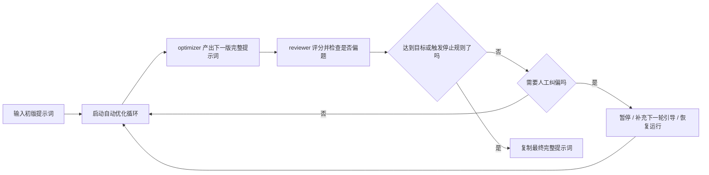

<p align="center">
  
</p>

# Prompt Optimizer Studio（提示词优化工作台）

**中文** | [英文](README_EN.md)

<p align="center">
  <a href="https://img.shields.io/github/v/release/XBigRoad/prompt-optimizer-studio?display_name=tag&style=flat-square"></a>
  <a href="https://img.shields.io/badge/edition-self--hosted-2d6a4f?style=flat-square"></a>
  <a href="https://img.shields.io/badge/providers-openai--compatible%20%2B%20more-f4a261?style=flat-square"></a>
  <a href="LICENSE"></a>
</p>

一个面向**自托管场景**的提示词优化工作台。你给出初版 prompt，系统按轮次做优化与复核；如果方向偏了，你可以暂停、补引导、继续一轮或恢复自动运行。最后交付的是**可直接复制的完整 prompt**，而不只是 patch 日志。

> 当前公开仓库交付的是 `Self-Hosted / Server Edition（自托管服务端版）`，不是官方在线 SaaS，也不承诺自动找出“唯一最优 prompt”。

<p align="center">
  <a href="#三句话先看懂"><strong>✨ 先看懂</strong></a> ·
  <a href="#你可以用它做什么"><strong>🧭 适用场景</strong></a> ·
  <a href="#工作流程一眼看懂"><strong>🔄 工作流程</strong></a> ·
  <a href="#页面截图"><strong>🖼️ 页面截图</strong></a> ·
  <a href="#开始使用"><strong>🚀 开始使用</strong></a> ·
  <a href="docs/deployment/docker-self-hosted.md"><strong>🐳 Docker 自托管</strong></a>
</p>

## 三句话先看懂

| 你最关心的事 | 这里怎么回答 |
| --- | --- |
| **它是什么** | 一个把提示词优化做成“可暂停、可继续、可复核”的自托管工作台 |
| **它怎么跑** | 初版 prompt → optimizer / reviewer 多轮推进 → 人工可随时纠偏 → 交付完整 prompt |
| **它不是什么** | 不是只展示 diff 的改写器，也不是替你自动证明“这就是全局最优”的黑盒系统 |

## 你可以用它做什么

| 如果你现在遇到的是 | Prompt Optimizer Studio 更适合怎么帮你 |
| --- | --- |
| 手里有一个初版 prompt，但还不能直接交付 | 保留完整提示词主线，按轮次持续打磨，而不是只给你 patch 片段 |
| 想自动多轮推进，但又怕越跑越偏 | 让 optimizer / reviewer 自动跑，同时保留人工暂停、补引导和单轮继续的入口 |
| 需要把结果交给同事或客户 | 最后拿到的是一份可以直接复制使用的完整 prompt，而不是内部 diff 日志 |
| 想在自己的环境里接不同 provider / 模型 | 走自托管服务端路径，保留配置、运行参数和结果链路的可检查性 |

## 工作流程一眼看懂



## 为什么它读起来不像普通 patch 展示器

- **完整提示词优先**
  - 主交付物始终是当前最新完整提示词，而不是 diff 视图。
- **人工介入是主路径的一部分**
  - 跑偏时可以暂停、补引导、继续一轮或恢复自动运行，不需要推倒重来。
- **停止逻辑可见**
  - 任务会持续推进到达标，或者停在明确的停止条件上，不是完全黑盒。
- **尽量减少越优化越偏题**
  - `goalAnchor`、drift checks 和 reviewer 隔离会一起帮助约束方向。

## 页面截图

以下截图基于当前公开候选版本的本地自托管实例拍摄。

| 任务控制室 | 结果台 | 配置台 |
| --- | --- | --- |
|  |  |  |

## 开始使用

| 你现在想做什么 | 入口 |
| --- | --- |
| 先在本地跑起来 | [快速开始](#快速开始) |
| 用 Docker 自托管 | [Docker 自托管文档](docs/deployment/docker-self-hosted.md) |
| 看版本更新记录 | [Releases](https://github.com/XBigRoad/prompt-optimizer-studio/releases) |
| 了解常见问题与限制 | [常见问题](#常见问题) |

更多信息： [配置方式](#配置方式) · [项目文档](#项目文档)

## 项目文档

- [英文首页](README_EN.md)
- [贡献指南](CONTRIBUTING.md)
- [安全策略](SECURITY.md)
- [行为准则](CODE_OF_CONDUCT.md)
- [开源发布文案](docs/open-source-launch.md)
- [许可证](LICENSE)

## 快速开始

### 环境要求

- `Node 22.22.x`
- `npm`

### 本地开发

```bash
npm install
npm run dev
```

打开：

```text
http://localhost:3000
```

### 完整检查

```bash
npm run check
```

### Docker 自托管

```bash
cp .env.example .env
docker compose up -d --build
```

打开：

```text
http://localhost:3000
```

可选健康检查：

```bash
curl http://localhost:3000/api/health
```

完整部署说明见 [Docker 自托管文档](docs/deployment/docker-self-hosted.md)。

## 配置方式

应用通过**配置台**完成配置。

当前配置台提供：

- `Base URL`
- `API Key`
- `快速选择服务商`
- `接口协议`（自动判断 / 手动覆盖）
- `全局评分标准覆写`
- 默认任务模型别名
- 默认运行项：`workerConcurrency`、`scoreThreshold`、`maxRounds`

任务层还支持：

- 新建任务时填写 `任务级评分标准覆写`
- 在结果台直接查看 `当前评分标准`
- 在任务详情页编辑 `任务级评分标准覆写`

当前支持：

- **OpenAI-compatible**：`GET /models` + `POST /chat/completions`
- **Anthropic 官方 API**：`GET /v1/models` + `POST /v1/messages`
- **Gemini 官方 API**：`GET /v1beta/models` + `POST /v1beta/models/{model}:generateContent`
- **Mistral 官方 API**：`GET /models` + `POST /chat/completions`
- **Cohere 官方 API**：`GET /v2/models` + `POST /v2/chat`

常见 provider 预设包括：

- `OpenAI`
- `Anthropic (Claude)`
- `Google Gemini`
- `Mistral`
- `Cohere`
- `DeepSeek`
- `Moonshot (Kimi)`
- `通义千问 (Qwen)`
- `智谱 (GLM)`
- `OpenRouter`

常见 `Base URL` 示例：

- `https://api.openai.com/v1`
- `https://api.anthropic.com`
- `https://generativelanguage.googleapis.com`

如果你接的是官方 API，`Base URL` 直接填写官方根地址即可，不需要额外自建代理路径。

## 发布形态

当前仓库发布的是 **Self-Hosted / Server Edition（自托管服务端版）**。

- 本地 `npm` 运行时，数据保存在运行应用的机器上。
- Docker 自托管时，数据保存在服务端挂载卷中，而不是用户浏览器里。
- 由服务端发起请求，仍然是兼容 OpenAI-compatible Base URL 最广的一种形态。
- `Web Local Edition` 会作为另一种独立产品形态后续推进，但当前仓库没有交付它。

默认 SQLite 数据库位置：

```text
data/prompt-optimizer.db
```

也可以用环境变量覆盖：

```bash
PROMPT_OPTIMIZER_DB_PATH=/your/custom/path.db
```

## 常见问题

- **这是官方在线 SaaS 吗？**
  - 不是。当前仓库是自托管服务端版。
- **这个项目最终产出什么？**
  - 产出的是一份可以直接复制使用的完整提示词，它来自自动化多轮优化流水线。
- **优化过程中可以人工干预吗？**
  - 可以。你可以暂停任务、补充下一轮人工引导、只继续一轮，或者恢复自动运行。
- **支持哪些模型 / API？**
  - 当前公开版支持 OpenAI-compatible、Anthropic、Gemini、Mistral、Cohere，并为 DeepSeek / Kimi / Qwen / GLM / OpenRouter 提供预设入口与协议映射。
- **可以调整评分规则吗？**
  - 可以。配置台支持 `全局评分标准覆写`，单个任务也支持 `任务级评分标准覆写`，都接受 Markdown。
- **可以切换英文界面吗？**
  - 可以。当前公开版已经提供 `中文 / EN` 切换。
- **数据存在哪里？**
  - 存在运行这套应用的机器或挂载卷里的 SQLite 数据库中。
- **为什么使用 AGPL-3.0？**
  - 因为这个项目希望即使被别人改成在线服务继续对外提供，也必须继续公开对应源码。

## 贡献与许可证

- 贡献说明：[`CONTRIBUTING.md`](CONTRIBUTING.md)
- 安全策略：[`SECURITY.md`](SECURITY.md)
- 行为准则：[`CODE_OF_CONDUCT.md`](CODE_OF_CONDUCT.md)

本项目采用 `AGPL-3.0-only` 许可证。

用人话来说：

- 你可以使用、研究、修改和自托管它
- 如果你分发修改版，或者把修改版作为在线服务提供给其他用户使用，就需要按 AGPL 提供对应源码
- 完整条款见 [`LICENSE`](LICENSE)
