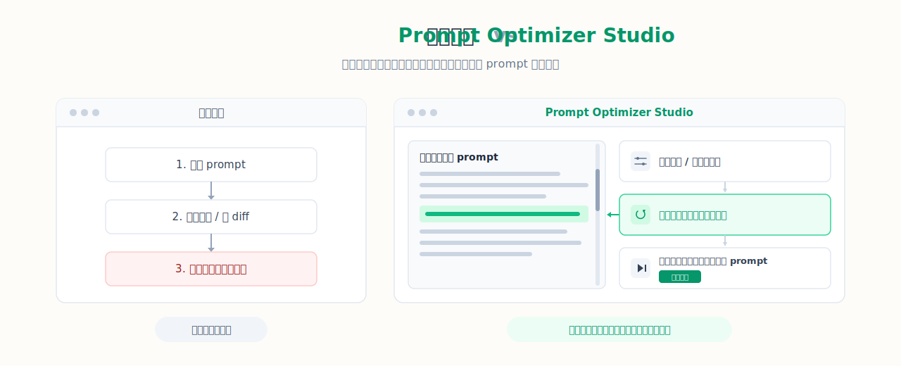
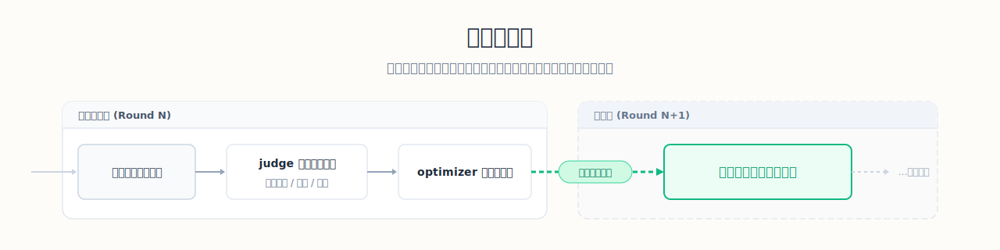

<p align="center">
  
</p>

# Prompt Optimizer Studio（提示词优化工作台）

**中文** | [英文](README_EN.md)

<p align="center">
  <a href="https://img.shields.io/github/v/release/XBigRoad/prompt-optimizer-studio?display_name=tag&style=flat-square"></a>
  <a href="https://img.shields.io/badge/edition-self--hosted-2d6a4f?style=flat-square"></a>
  <a href="https://img.shields.io/badge/providers-openai--compatible%20%2B%20more-f4a261?style=flat-square"></a>
  <a href="LICENSE"></a>
</p>

把一版 prompt 自动优化成高质量可直接交付的完整成品，而且中途随时能接管。

> 当前公开仓库交付的是 `Self-Hosted / Server Edition（自托管服务端版）`。

<p align="center">
  <a href="#user-content-适合拿来做什么"><strong>🎯 适合拿来做什么</strong></a> ·
  <a href="#user-content-先跑起来"><strong>🚀 先跑起来</strong></a> ·
  <a href="#user-content-工作流程"><strong>🔄 工作流程</strong></a> ·
  <a href="#user-content-页面截图"><strong>🖼️ 页面截图</strong></a> ·
  <a href="docs/deployment/docker-self-hosted.md"><strong>🐳 Docker 自托管</strong></a> ·
  <a href="https://github.com/XBigRoad/prompt-optimizer-studio/releases"><strong>Releases</strong></a>
</p>

<a id="先跑起来"></a>
## 🚀 先跑起来

### 🐳 方式 1：源码构建
```bash
git clone https://github.com/XBigRoad/prompt-optimizer-studio.git
cd prompt-optimizer-studio
cp .env.example .env
docker compose up -d --build
```

打开：

```text
http://localhost:3000
```

可选健康检查：

```bash
curl http://localhost:3000/api/health
```

如果你已经在仓库目录里，其实只需要后两步：

```bash
cp .env.example .env
docker compose up -d --build
```

### 📦 方式 2：官方镜像部署（发布版）

发布版会同步推送官方 Docker 镜像到 GHCR。拿到镜像后，可以直接这样跑：

```bash
docker run -d \
  --name prompt-optimizer-studio \
  -p 3000:3000 \
  -v prompt_optimizer_data:/app/data \
  --restart unless-stopped \
  ghcr.io/xbigroad/prompt-optimizer-studio:latest
```

如果你想锁定具体版本，把 `latest` 换成对应的 release tag 即可：

```bash
ghcr.io/xbigroad/prompt-optimizer-studio:<tag>
```

如果你想跟主线最新提交，可以改成：

```bash
ghcr.io/xbigroad/prompt-optimizer-studio:main
```

如果你要本地改代码，再走开发模式：

```bash
npm install
npm run dev
```

继续看这里：

- [Docker 自托管文档](docs/deployment/docker-self-hosted.md)
- [GitHub Container Registry](https://github.com/XBigRoad/prompt-optimizer-studio/pkgs/container/prompt-optimizer-studio)
- [Releases](https://github.com/XBigRoad/prompt-optimizer-studio/releases)
- [配置方式](#user-content-配置方式)
- [常见问题](#user-content-常见问题)


<a id="工作流程"></a>
## 🔄 工作流程

| 步骤 | 这里会发生什么 |
| --- | --- |
| `1. 提交初稿` | 先给系统一版 prompt，任务从这里开始 |
| `2. 系统跑一轮` | 同时做两件事：复核当前稿、生成下一稿 |
| `3. 你随时接管` | 可以暂停、补下一轮引导、改长期规则、改任务级 rubric，再继续 |
| `4. 达标后结束` | 不是某一轮刚过线就停，而是同一候选连续拿到可信通过后才真正完成 |





> 注意：这一轮新生成的稿子，不会当场评分，要到下一轮才会被复核。

<a id="适合拿来做什么"></a>
## 🎯 适合拿来做什么

| 如果你现在遇到的是 | Prompt Optimizer Studio 更适合怎么帮你 |
| --- | --- |
| 手里有一版 prompt，但还不能直接交付 | 保留完整 prompt 主线，按轮次持续打磨，而不是只给你 patch 片段 |
| 想自动多轮推进，但又怕越跑越偏 | 让系统持续往前跑，同时保留 `step / pause / 下一轮引导 / 长期规则 / task rubric` 这些接管入口 |
| 需要把结果交给同事、客户或自己下游继续用 | 最后拿到的是一份可以直接复制的完整 prompt，不是内部 diff 日志 |
| 想在自己的环境里接不同 provider / 模型 | 走自托管服务端路径，把设置、运行参数、结果链路和数据库都放在自己手里 |


## 📚 项目文档

- [英文首页](README_EN.md)
- [贡献指南](CONTRIBUTING.md)
- [安全策略](SECURITY.md)
- [行为准则](CODE_OF_CONDUCT.md)
- [开源发布文案](docs/open-source-launch.md)
- [许可证](LICENSE)

<a id="页面截图"></a>
## 🖼️ 页面截图

当前截图基于 `v0.1.7` 。

| 任务控制室 | 结果台 | 配置台 |
| --- | --- | --- |
|  |  |  |

## 🛠️ 本地开发与验证

### 环境要求

- `Node 22.22.x`
- `npm`

### 本地开发

```bash
npm install
npm run dev
```

打开：

```text
http://localhost:3000
```

### 完整检查

```bash
npm run check
```

它会依次执行：

- `typecheck`
- `test`
- `build`

完整部署说明见前面的 [Docker 自托管文档](docs/deployment/docker-self-hosted.md)。

<a id="配置方式"></a>
## ⚙️ 配置方式

应用通过**配置台**完成配置。

当前配置台对外暴露的核心项：

- `Base URL`
- `API Key`
- `快速选择服务商`
- `接口协议`（自动判断 / 手动覆盖）
- `全局评分标准覆写`
- 默认任务模型别名
- 默认推理强度
- 默认运行项：`workerConcurrency`、`scoreThreshold`、`maxRounds`

任务层还支持：

- 新建任务时填写 `任务级评分标准覆写`
- 在结果台直接查看 `当前评分标准`
- 在任务详情页编辑 `任务级评分标准覆写`
- 在任务详情页调整任务模型、推理强度和任务级轮数上限
- 直接维护“下一轮引导”和“长期规则”
- 从最新评审建议里手动或自动采纳建议

当前支持：

- **OpenAI-compatible**：`GET /models` + `POST /chat/completions`
- **Anthropic 官方 API**：`GET /v1/models` + `POST /v1/messages`
- **Gemini 官方 API**：`GET /v1beta/models` + `POST /v1beta/models/{model}:generateContent`
- **Mistral 官方 API**：`GET /models` + `POST /chat/completions`
- **Cohere 官方 API**：`GET /v2/models` + `POST /v2/chat`

常见 provider 预设包括：

- `OpenAI`
- `Anthropic (Claude)`
- `Google Gemini`
- `Mistral`
- `Cohere`
- `DeepSeek`
- `Moonshot (Kimi)`
- `通义千问 (Qwen)`
- `智谱 (GLM)`
- `OpenRouter`

常见 `Base URL` 示例：

- `https://api.openai.com/v1`
- `https://api.anthropic.com`
- `https://generativelanguage.googleapis.com`

如果你接的是官方 API，`Base URL` 直接填写官方根地址即可，不需要额外自建代理路径。

补充说明：

- 配置台对外展示的是统一的“默认任务模型 + 推理强度”；当前公开版会把它同步应用到 optimizer / judge 两端。
- `任务级评分标准覆写` 接受 Markdown。只有**结构化可解析**的 rubric 才会自动生成分项分数条；自由文本 rubric 不会被系统乱猜。
- 中途修改任务级 rubric 后：
  - 新轮次按新 rubric 出分
  - 旧轮次继续按旧 snapshot 显示
- 运行中的任务如果修改模型或推理强度，通常会在下一轮生效，而不是强插进当前正在跑的这一轮。

## 📦 发布形态

当前仓库发布的是 **Self-Hosted / Server Edition（自托管服务端版）**。

- 本地 `npm` 运行时，数据保存在运行应用的机器上。
- Docker 自托管时，数据保存在服务端挂载卷中，而不是用户浏览器里。
- 由服务端发起请求，仍然是兼容 OpenAI-compatible Base URL 最广的一种形态。
- `Web Local Edition` 会作为另一种独立产品形态后续推进，但当前仓库没有交付它。

默认 SQLite 数据库位置：

```text
data/prompt-optimizer.db
```

也可以用环境变量覆盖：

```bash
PROMPT_OPTIMIZER_DB_PATH=/your/custom/path.db
```

<a id="常见问题"></a>
## ❓ 常见问题

- **这是官方在线 SaaS 吗？**
  - 不是。当前仓库是自托管服务端版。
- **这个项目最终产出什么？**
  - 产出的是一份可以直接复制使用的完整提示词，它来自自动化多轮优化流水线。
- **优化过程中可以人工干预吗？**
  - 可以。你可以暂停任务、补充下一轮人工引导、只继续一轮，或者恢复自动运行。
- **任务到底什么时候才算完成？**
  - 当前公开版默认不是“单轮及格就停”。同一候选稿需要连续拿到多次可信通过（默认 3 次），并且没有 material issues / drift，才会进入 `completed`。
- **什么情况下会进入 `manual_review`？**
  - 常见情况包括：达到最大轮数、命中严格 no-output 守卫、或者系统认为这时应该由你决定下一步。它表示“需要你接手”，不等于任务彻底坏掉。
- **支持哪些模型 / API？**
  - 当前公开版支持 OpenAI-compatible、Anthropic、Gemini、Mistral、Cohere，并为 DeepSeek / Kimi / Qwen / GLM / OpenRouter 提供预设入口与协议映射。
- **可以调整评分规则吗？**
  - 可以。配置台支持 `全局评分标准覆写`，单个任务也支持 `任务级评分标准覆写`，都接受 Markdown。
- **中途改 rubric 会不会把旧轮次弄乱？**
  - 不会。旧轮次会优先按当轮 `rubricDimensionsSnapshot` 显示；新轮次才会使用你后来保存的新 rubric。
- **为什么有些轮次有分数条，有些没有？**
  - 只有成功拿到可信结构化评分、而且 rubric 可安全对齐时，才会显示分项分数条。如果这一轮是请求层失败、结构化评分无效，或者 rubric 不是结构化格式，就不会硬画一组不可信的空条。
- **评审建议可以自动进入后续轮次吗？**
  - 可以。你可以手动把建议加入下一轮引导或长期规则；最新面板还支持开启后续每轮自动采纳。
- **任务完成以后还能继续吗？**
  - 可以。已完成任务可以继续当前任务，也可以直接从最终稿 fork 一条新任务。
- **可以切换英文界面吗？**
  - 可以。当前公开版已经提供 `中文 / EN` 切换。
- **数据存在哪里？**
  - 存在运行这套应用的机器或挂载卷里的 SQLite 数据库中。
- **为什么使用 AGPL-3.0？**
  - 因为这个项目希望即使被别人改成在线服务继续对外提供，也必须继续公开对应源码。

## 🤝 贡献与许可证

- 贡献说明：[`CONTRIBUTING.md`](CONTRIBUTING.md)
- 安全策略：[`SECURITY.md`](SECURITY.md)
- 行为准则：[`CODE_OF_CONDUCT.md`](CODE_OF_CONDUCT.md)

本项目采用 `AGPL-3.0-only` 许可证。

- 你可以使用、研究、修改和自托管它
- 如果你分发修改版，或者把修改版作为在线服务提供给其他用户使用，就需要按 AGPL 提供对应源码
- 完整条款见 [`LICENSE`](LICENSE)
