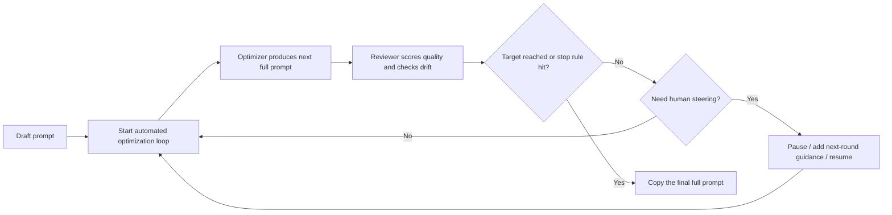

<p align="center">
  
</p>

# Prompt Optimizer Studio

[Chinese Home](./) | **English**

<p align="center">
  <a href="https://img.shields.io/github/v/release/XBigRoad/prompt-optimizer-studio?display_name=tag&style=flat-square"></a>
  <a href="https://img.shields.io/badge/edition-self--hosted-2d6a4f?style=flat-square"></a>
  <a href="https://img.shields.io/badge/storage-local%20SQLite-52796f?style=flat-square"></a>
  <a href="https://img.shields.io/badge/providers-OpenAI%20compatible%20%7C%20Anthropic%20%7C%20Gemini-f4a261?style=flat-square"></a>
  <a href="LICENSE"></a>
</p>

Automated, pipeline-style prompt optimization for people who still want control.
Draft a prompt, let the system iterate round by round, pause to steer when needed, and end with a copy-ready final full prompt instead of a patch log.

> Current release: `Self-Hosted / Server Edition`
>
> This repository ships the self-hosted server edition today. A separate `Web Local Edition` may come later, but it is not part of this release.

## Why This Project Exists

Most prompt optimizers stop at showing diffs, patch fragments, or internal reasoning.

`Prompt Optimizer Studio` is built around a different promise:

- **Automated prompt optimization pipeline**
  - The optimizer and reviewer keep iterating until the target is reached or the round budget is exhausted.
- **Human steering stays in the loop**
  - Pause a task, add next-round guidance, continue one round, or resume auto without restarting from scratch.
- **The final artifact is the full prompt**
  - The latest prompt is always visible, copyable, and ready to use.
- **The process stays inspectable**
  - You can review round history, drift diagnostics, and stop conditions instead of trusting a black box.

## How It Works



## What Makes It Feel Different

- **Full prompt first**
  - The main deliverable is the prompt you can actually ship, not a diff viewer.
- **Operator in the loop**
  - Human intervention is a first-class control path, not an afterthought.
- **Multi-round automation with visible stop logic**
  - Runs keep going until they pass the target or hit the configured round limits.
- **Intent protection**
  - `goalAnchor`, drift labels, and reviewer isolation help reduce silent prompt drift.

## Entry Points

- [First Release](https://github.com/XBigRoad/prompt-optimizer-studio/releases/tag/v0.1.0)
- [Quick Start](#quick-start)
- [FAQ](#faq)
- [Docker Self-Hosted Guide](docs/deployment/docker-self-hosted_EN.md)

## Project Docs

- [Chinese Home](./)
- [Contributing](CONTRIBUTING_EN.md)
- [Security Policy](SECURITY_EN.md)
- [Code of Conduct](CODE_OF_CONDUCT_EN.md)
- [Open Source Launch Copy](docs/open-source-launch_EN.md)
- [License](LICENSE)

## Screenshots

The screenshots below are captured from stable demo data generated by `npm run demo:seed`.

| Control Room | Result Desk | Config Desk |
| --- | --- | --- |
|  |  |  |

## Quick Start

### Requirements

- `Node 22.22.x`
- `npm`

### Local Development

```bash
npm install
npm run dev
```

Open:

```text
http://localhost:3000
```

### Full Verification

```bash
npm run check
```

### Docker Self-Hosted

```bash
cp .env.example .env
docker compose up -d --build
```

Open:

```text
http://localhost:3000
```

Optional health check:

```bash
curl http://localhost:3000/api/health
```

For full deployment instructions, see the [Docker self-hosted guide](docs/deployment/docker-self-hosted_EN.md).

## Configuration

The app is configured from the **Config Desk**.

The public UI intentionally stays simple:

- `Base URL`
- `API Key`
- default task model alias
- active runtime controls: `scoreThreshold`, `maxRounds`

Supported today:

- **OpenAI-compatible**: `GET /models` + `POST /chat/completions`
- **Anthropic official API**: `GET /v1/models` + `POST /v1/messages`
- **Gemini official API**: `GET /v1beta/models` + `POST /v1beta/models/{model}:generateContent`

Common `Base URL` examples:

- `https://api.openai.com/v1`
- `https://api.anthropic.com`
- `https://generativelanguage.googleapis.com`

Official APIs work directly from their provider root. No custom proxy path is required.

## Deployment Model

This repository currently ships the **Self-Hosted / Server Edition**.

- Local `npm` runs store data on the machine running the app.
- Docker deployments store data in the mounted server-side volume, not in each user's browser.
- Server-originated requests remain the broadest compatibility path for OpenAI-compatible endpoints.
- A separate `Web Local Edition` is planned later, but it is not shipped here today.

Default SQLite path:

```text
data/prompt-optimizer.db
```

You can override it with:

```bash
PROMPT_OPTIMIZER_DB_PATH=/your/custom/path.db
```

## FAQ

- **Is this a hosted SaaS?**
  - No. This repository currently ships the self-hosted server edition.
- **What is the main output?**
  - A copy-ready full prompt produced by an automated multi-round optimization pipeline.
- **Can I intervene during optimization?**
  - Yes. You can pause a task, add next-round steering, continue one round, or resume automatic execution.
- **Which APIs does it support?**
  - The UI stays on `Base URL`, `API Key`, and model alias while the backend supports OpenAI-compatible, Anthropic official, and Gemini official APIs.
- **Where is data stored?**
  - In the local SQLite database on the machine or mounted volume running the app.
- **Why AGPL-3.0?**
  - Because modified hosted versions should remain source-available to the users who depend on them.

## Contributing And License

- Contribution guide: [`CONTRIBUTING_EN.md`](CONTRIBUTING_EN.md)
- Security policy: [`SECURITY_EN.md`](SECURITY_EN.md)
- Code of conduct: [`CODE_OF_CONDUCT_EN.md`](CODE_OF_CONDUCT_EN.md)

This project is licensed under `AGPL-3.0-only`.

In plain language:

- you can use, study, modify, and self-host it
- if you distribute a modified version, or run a modified version for other users over a network, you must provide the corresponding source code under AGPL as well
- see [`LICENSE`](LICENSE) for the full text
