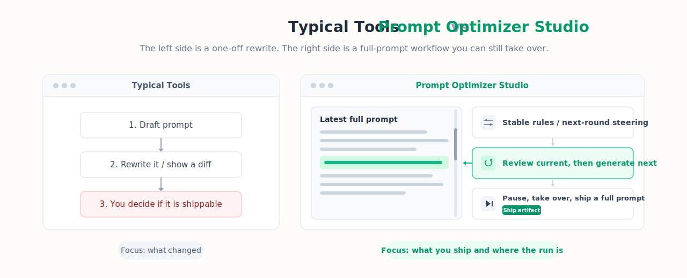
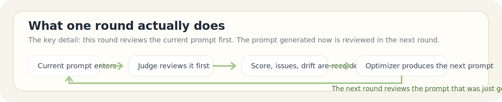

<p align="center">
  
</p>

# Prompt Optimizer Studio

[Chinese Home](README.md) | **English**

<p align="center">
  <a href="https://img.shields.io/github/v/release/XBigRoad/prompt-optimizer-studio?display_name=tag&style=flat-square"></a>
  <a href="https://img.shields.io/badge/edition-self--hosted-2d6a4f?style=flat-square"></a>
  <a href="https://img.shields.io/badge/providers-openai--compatible%20%2B%20more-f4a261?style=flat-square"></a>
  <a href="LICENSE"></a>
</p>

Automated, pipeline-style prompt optimization for people who still want control. ✨ It turns one-off prompt rewriting into a pauseable, steerable, multi-round workflow.
Start from a draft prompt, let the system iterate round by round, and step in whenever the run drifts so you end with a copy-ready full prompt instead of a patch log.

> This repository currently ships the `Self-Hosted / Server Edition`.

<p align="center">
  <a href="#what-you-can-use-it-for"><strong>✨ What It Does</strong></a> ·
  <a href="#how-it-works"><strong>🔄 Workflow</strong></a> ·
  <a href="#start-here"><strong>🚀 Start Here</strong></a> ·
  <a href="#screenshots"><strong>🖼️ Screenshots</strong></a> ·
  <a href="docs/deployment/docker-self-hosted_EN.md"><strong>🐳 Docker Self-Hosted</strong></a> ·
  <a href="https://github.com/XBigRoad/prompt-optimizer-studio/releases"><strong>Releases</strong></a>
</p>

## What It Is Best At

- **It keeps the full prompt as the main artifact**
  - This is not a diff viewer. The system keeps a visible `latest full prompt` all the way through, and the thing you ship is still the full prompt.
- **It automates the loop without taking control away from you**
  - You can let it run, inspect one round at a time, pause, add next-round steering, change stable rules, or switch the task-level rubric and keep going.
- **Each round tries to stay explainable**
  - You can trace what got reviewed, why the run continued, why it paused, why there was no new output, and why score bars did or did not render.

## How It Runs



### One Round Actually Works Like This



- A round does two different things: **review the current prompt** and **produce the next prompt**.
- That means the prompt generated in round `N` is reviewed in round `N+1`, not immediately.
- `completed` does not mean “one passing score.” The same candidate needs a credible pass streak before the job is actually done.

## What You Can Use It For

| If what you have right now is | Prompt Optimizer Studio is better at helping by |
| --- | --- |
| A draft prompt that still cannot be shipped | keeping one full-prompt line of history and refining it round by round instead of showing patch fragments |
| A desire to automate multiple rounds without losing control | keeping `step / pause / next-round steering / stable rules / task rubric` as real operator controls |
| A need to hand the result to a teammate, client, or downstream system | producing a copy-ready full prompt instead of an internal diff log |
| A need to run inside your own provider / model environment | staying self-hosted, with settings, runtime policy, and result history under your own control |

## Start Here

🚀 If you want to get started right now, these are the only links you need first:

| What you want to do now | Entry |
| --- | --- |
| Run it locally | [Quick Start](#quick-start) |
| Self-host with Docker | [Docker Self-Hosted Guide](docs/deployment/docker-self-hosted_EN.md) |
| Check release packages and updates | [Releases](https://github.com/XBigRoad/prompt-optimizer-studio/releases) |
| Read common questions | [FAQ](#faq) |

More: [Configuration](#configuration) · [Screenshots](#screenshots)

## Other Ways It Differs From Typical Tools

- **You are not looking at a patch viewer; you are following one full prompt line**
- **You are taking over a workflow, not just attaching comments**
- **Older rounds do not get rewritten just because you edited the rubric later**
- **Structured scoring can become visible score bars, not just a single overall score**
- **Failure states try to tell the truth instead of collapsing into one vague error**

## Project Docs

- [Chinese Home](README.md)
- [Contributing](CONTRIBUTING_EN.md)
- [Security Policy](SECURITY_EN.md)
- [Code of Conduct](CODE_OF_CONDUCT_EN.md)
- [Open Source Launch Copy](docs/open-source-launch_EN.md)
- [License](LICENSE)

## Screenshots

The screenshots below are captured from a `v0.1.8` self-hosted instance.

| Control Room | Result Desk | Config Desk |
| --- | --- | --- |
|  |  |  |

## Quick Start

### Requirements

- `Node 22.22.x`
- `npm`

### Local Development

```bash
npm install
npm run dev
```

Open:

```text
http://localhost:3000
```

### Full Verification

```bash
npm run check
```

That command runs:

- `typecheck`
- `test`
- `build`

### Docker Self-Hosted

```bash
cp .env.example .env
docker compose up -d --build
```

Open:

```text
http://localhost:3000
```

Optional health check:

```bash
curl http://localhost:3000/api/health
```

For full deployment instructions, see the [Docker self-hosted guide](docs/deployment/docker-self-hosted_EN.md).

## Configuration

The app is configured from the **Config Desk**.

The current public UI exposes these core controls:

- `Base URL`
- `API Key`
- quick provider preset
- API protocol override
- global scoring override
- default task model alias
- default reasoning effort
- runtime defaults: `workerConcurrency`, `scoreThreshold`, `maxRounds`

At the job level, the public build also supports:

- task-level scoring override during submission
- current scoring preview inside the Result Desk
- editing task-level scoring override from the job detail page
- adjusting task model, reasoning effort, and max-round override from job detail
- maintaining next-round steering and stable rules separately
- adopting review suggestions manually or automatically from the latest panel

Supported today:

- **OpenAI-compatible**: `GET /models` + `POST /chat/completions`
- **Anthropic official API**: `GET /v1/models` + `POST /v1/messages`
- **Gemini official API**: `GET /v1beta/models` + `POST /v1beta/models/{model}:generateContent`
- **Mistral official API**: `GET /models` + `POST /chat/completions`
- **Cohere official API**: `GET /v2/models` + `POST /v2/chat`

Common provider presets include:

- `OpenAI`
- `Anthropic (Claude)`
- `Google Gemini`
- `Mistral`
- `Cohere`
- `DeepSeek`
- `Moonshot (Kimi)`
- `Qwen`
- `GLM`
- `OpenRouter`

Common `Base URL` examples:

- `https://api.openai.com/v1`
- `https://api.anthropic.com`
- `https://generativelanguage.googleapis.com`

Official APIs work directly from their provider root. No custom proxy path is required.

Additional notes:

- The visible settings UI presents a unified “default task model + reasoning effort”; the public build applies that default to optimizer and judge together.
- Job-level rubric overrides accept Markdown. Only **structured, parseable** rubrics render per-dimension score bars; free-form text is not guessed into fake dimensions.
- If you edit a job-level rubric mid-run:
  - new rounds score against the new rubric
  - old rounds keep their old snapshot
- Model or reasoning-effort edits made while a job is already running usually take effect on the next round, not by rewriting the round currently in flight.

## Deployment Model

This repository currently ships the **Self-Hosted / Server Edition**.

- Local `npm` runs store data on the machine running the app.
- Docker deployments store data in the mounted server-side volume, not in each user's browser.
- Server-originated requests remain the broadest compatibility path for OpenAI-compatible endpoints.
- A separate `Web Local Edition` is planned later, but it is not shipped here today.

Default SQLite path:

```text
data/prompt-optimizer.db
```

You can override it with:

```bash
PROMPT_OPTIMIZER_DB_PATH=/your/custom/path.db
```

## FAQ

- **Is this a hosted SaaS?**
  - No. This repository currently ships the self-hosted server edition.
- **What is the main output?**
  - A copy-ready full prompt produced by an automated multi-round optimization pipeline.
- **Can I intervene during optimization?**
  - Yes. You can pause a task, add next-round steering, continue one round, or resume automatic execution.
- **When is a job actually considered complete?**
  - The public build does not stop on a single passing review. By default, the same candidate must earn multiple credible passes in a row (default: 3) with no material issues or drift before the job becomes `completed`.
- **What puts a job into `manual_review`?**
  - Common triggers include hitting the max-round cap, tripping the strict no-output guard, or reaching a point where the operator should decide what happens next.
- **Which APIs does it support?**
  - The current public build supports OpenAI-compatible, Anthropic, Gemini, Mistral, and Cohere, with presets and protocol mapping for DeepSeek, Kimi, Qwen, GLM, and OpenRouter.
- **Can I customize the scoring rubric?**
  - Yes. The Config Desk supports a global scoring override, and each job can also carry its own task-level scoring override in Markdown.
- **Will editing the rubric mid-run break older rounds?**
  - No. Older rounds prefer their own `rubricDimensionsSnapshot`, while new rounds use the rubric you saved later.
- **Why do some rounds show score bars and others do not?**
  - Score bars appear only when the round returned a credible structured review and the rubric can be aligned safely. Provider failures, invalid structured scores, or unstructured rubrics do not render fake bars.
- **Can review suggestions flow into future rounds automatically?**
  - Yes. You can adopt them manually into next-round steering or stable rules, and the latest panel can auto-adopt future suggestions too.
- **Can I keep working after a job is completed?**
  - Yes. Completed jobs can continue, restart, or fork a fresh job from the final prompt.
- **Can I switch the interface to English?**
  - Yes. The current public build already includes an in-app `中文 / EN` toggle.
- **Where is data stored?**
  - In the local SQLite database on the machine or mounted volume running the app.
- **Why AGPL-3.0?**
  - Because modified hosted versions should remain source-available to the users who depend on them.

## Contributing And License

- Contribution guide: [`CONTRIBUTING_EN.md`](CONTRIBUTING_EN.md)
- Security policy: [`SECURITY_EN.md`](SECURITY_EN.md)
- Code of conduct: [`CODE_OF_CONDUCT_EN.md`](CODE_OF_CONDUCT_EN.md)

This project is licensed under `AGPL-3.0-only`.

In plain language:

- you can use, study, modify, and self-host it
- if you distribute a modified version, or run a modified version for other users over a network, you must provide the corresponding source code under AGPL as well
- see [`LICENSE`](LICENSE) for the full text
