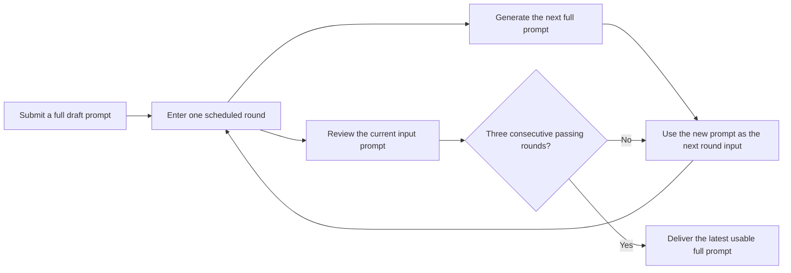
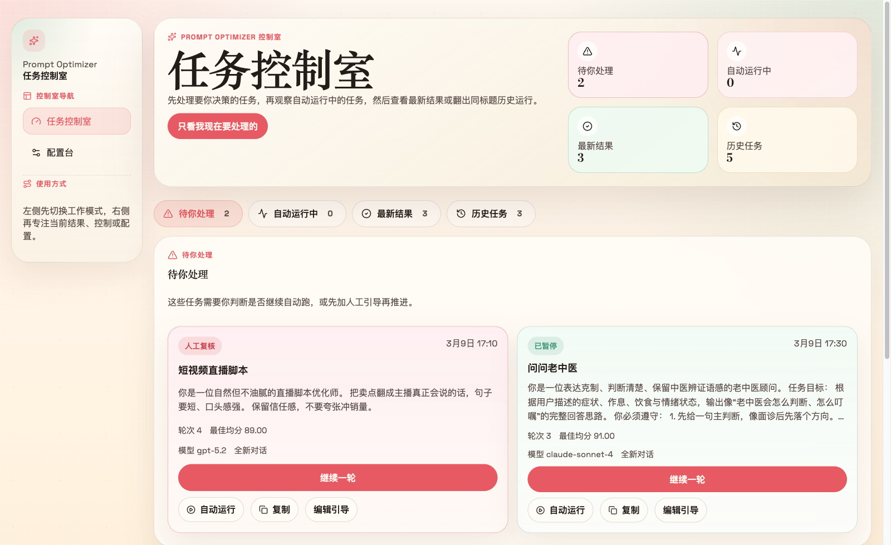
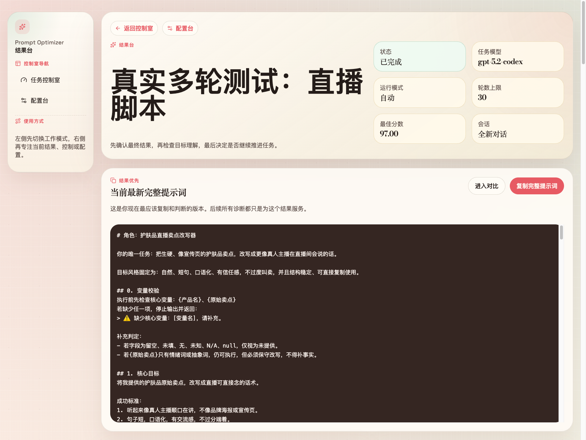
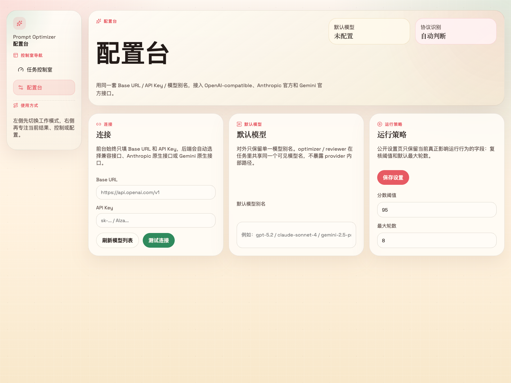

<p align="center">
  
</p>

# Prompt Optimizer Studio

[Chinese Home](README.md) | **English**

<p align="center">
  <a href="https://img.shields.io/github/v/release/XBigRoad/prompt-optimizer-studio?display_name=tag&style=flat-square"></a>
  <a href="https://img.shields.io/badge/edition-self--hosted-2d6a4f?style=flat-square"></a>
  <a href="https://img.shields.io/badge/providers-openai--compatible%20%2B%20more-f4a261?style=flat-square"></a>
  <a href="LICENSE"></a>
</p>

A **self-hosted** prompt-optimization workspace for teams and individuals who want visibility and control. You submit a draft prompt, the system keeps iterating around the current version, and you can pause, steer, continue one round, adjust stable rules, or resume auto when needed. The deliverable is a **copy-ready full prompt**, not just a patch log.

> This repository ships the `Self-Hosted / Server Edition`. It is not an official hosted SaaS, and it does not claim to automatically prove a single globally optimal prompt.

**What you get**

- 🧾 a copy-ready full prompt instead of patch fragments
- 🔁 a multi-round optimization flow you can pause, steer, and inspect
- 🛠️ settings, runtime controls, and results that stay in your own environment

<p align="center">
  <a href="#-three-things-to-know-first"><strong>👀 First Look</strong></a> ·
  <a href="#-how-it-works"><strong>🧭 Workflow</strong></a> ·
  <a href="#-what-one-round-actually-means"><strong>🔄 Round Semantics</strong></a> ·
  <a href="#-current-stop-rule"><strong>🛑 Stop Rule</strong></a> ·
  <a href="#-temporary-steering-and-stable-rules"><strong>🧩 Steering</strong></a> ·
  <a href="#-screenshots"><strong>🖼️ Screenshots</strong></a> ·
  <a href="#-start-here"><strong>🚀 Start Here</strong></a> ·
  <a href="docs/deployment/docker-self-hosted_EN.md"><strong>🐳 Docker Self-Hosted</strong></a>
</p>

## 👀 Three Things to Know First

| The question | The short answer |
| --- | --- |
| **What is it?** | A self-hosted workspace that turns prompt optimization into a pauseable, steerable, reviewable process |
| **How does it run?** | The current prompt enters a round, the system reviews that current version and generates the next version, and the new version is reviewed in the next round |
| **What is it not?** | Not just a diff viewer, and not a black box pretending it can stamp one final perfect answer for you |

## 🎯 What You Can Use It For

| If your situation looks like this | Prompt Optimizer Studio is better suited to |
| --- | --- |
| You have a draft prompt but it is not ready to hand off yet | Keep refining toward a usable full prompt instead of only showing patch fragments |
| You want automatic multi-round improvement without losing control | Let the system keep moving while preserving pause, next-round steering, stable rules, and one-round-continue controls |
| You need something you can pass to teammates or clients | End with a full prompt you can directly copy and use |
| You want to connect your own providers and models | Run it as a self-hosted server path with inspectable settings, runtime, and result history |

## 🧭 How It Works



## 🔄 What One Round Actually Means

The public product semantics are not "optimize first, then score the new output." A round actually works like this:

| What happens inside one round | What it means |
| --- | --- |
| **The current full prompt enters the round** | That same prompt is both the review target and the base input for generating the next version |
| **The review side checks the current input prompt** | The score shown for this round belongs to the prompt that entered the round |
| **The optimizer generates the next full prompt** | The newly generated prompt is not scored in the same round; it is reviewed in the next round |
| **Runtime chooses execution style** | Depending on provider capability and stability conditions, the two sides may run in parallel or sequentially |

In short: **the score you see belongs to the current input prompt, while the output of the round becomes the next prompt.**

## 🛑 Current Stop Rule

The current public stop rule is:

- the user sets the **score threshold**
- the system currently requires **three consecutive passing reviewed rounds**
- a passing reviewed round means:
  - `score >= scoreThreshold`
  - and no material issues
- on the third consecutive passing reviewed round:
  - if the round also produced a new output, that new output becomes the final delivery
  - if the round passed review but produced no new output, the already reviewed passing input becomes the final delivery
- if the job hits `maxRounds` before that streak is complete, it stops at manual review instead of pretending to be done

## 🧩 Temporary Steering And Stable Rules

These are two different concepts in the product:

| Concept | Current behavior |
| --- | --- |
| **Next-round steering** | A one-time addition for the next round, absorbed by the optimizer in order |
| **Stable rules** | Persistent constraints for later rounds, updated only after you explicitly save them |

Additional notes:

- the review side does not directly read your raw steering text; it only sees the prompt generated for the next round
- you can select pending steering items, build a stable-rule draft, and then decide whether to save it
- unselected or unsaved steering items do not silently become stable rules
- if a one-time steering note gets written into the full prompt itself, later rounds inherit that through the prompt content, not because the system secretly keeps the steering item forever

## 🖼️ Screenshots

The screenshots below were captured from the current public build running as a local self-hosted instance.

| Control Room | Result Desk | Config Desk |
| --- | --- | --- |
|  |  |  |

## 🚀 Start Here

| What you want to do now | Entry |
| --- | --- |
| Run it locally first | [Quick Start](#quick-start) |
| Self-host with Docker | [Docker Self-Hosted Guide](docs/deployment/docker-self-hosted_EN.md) |
| Check release history | [Releases](https://github.com/XBigRoad/prompt-optimizer-studio/releases) |
| Read common questions and limits | [FAQ](#faq) |

More: [Configuration](#configuration) · [Project Docs](#project-docs)

## 📚 Project Docs

- [Chinese Home](README.md)
- [Contributing](CONTRIBUTING_EN.md)
- [Security Policy](SECURITY_EN.md)
- [Code of Conduct](CODE_OF_CONDUCT_EN.md)
- [Open Source Launch Copy](docs/open-source-launch_EN.md)
- [License](LICENSE)

## ⚡ Quick Start

### 📦 Requirements

- `Node 22.22.x`
- `npm`

### 💻 Local Development

```bash
npm install
npm run dev
```

Open:

```text
http://localhost:3000
```

### ✅ Full Verification

```bash
npm run check
```

### 🐳 Docker Self-Hosted

```bash
cp .env.example .env
docker compose up -d --build
```

Open:

```text
http://localhost:3000
```

Optional health check:

```bash
curl http://localhost:3000/api/health
```

For full deployment instructions, see the [Docker self-hosted guide](docs/deployment/docker-self-hosted_EN.md).

## ⚙️ Configuration

The app is configured from the **Config Desk**.

The Config Desk exposes:

- `Base URL`
- `API Key`
- quick provider preset
- API protocol override
- global scoring override
- default task model
- default reasoning effort
- runtime defaults: `workerConcurrency`, `scoreThreshold`, `maxRounds`

At the job level, the public build also supports:

- task-level scoring override during submission
- choosing model and reasoning effort during submission
- adjusting task model, reasoning effort, and round cap from the job detail page
- inspecting the active scoring rubric, next-round steering, and stable rules in job detail

## 🔌 Provider And Compatibility Notes

The current public build supports:

- **OpenAI-compatible gateways**
  - model discovery plus capability-aware request routing
  - routing between `chat/completions` and `responses` when appropriate, with fallback when needed
- **Anthropic official API**
- **Gemini official API**
- **Mistral official API**
- **Cohere official API**

Common provider presets include:

- `OpenAI`
- `Anthropic (Claude)`
- `Google Gemini`
- `Mistral`
- `Cohere`
- `DeepSeek`
- `Moonshot (Kimi)`
- `Qwen`
- `GLM`
- `OpenRouter`

Common `Base URL` examples:

- `https://api.openai.com/v1`
- `https://api.anthropic.com`
- `https://generativelanguage.googleapis.com`

Official APIs work directly from their provider root. No custom proxy path is required.

## 🏗️ Deployment Model

This repository currently ships the **Self-Hosted / Server Edition**.

- local `npm` runs store data on the machine running the app
- Docker deployments store data in the mounted server-side volume, not in each user's browser
- requests are sent from the server, which fits both self-hosted gateways and official APIs
- a separate `Web Local Edition` may come later, but it is not shipped here today

Default database path:

```text
data/prompt-optimizer.db
```

You can override it with:

```bash
PROMPT_OPTIMIZER_DB_PATH=/your/custom/path.db
```

## ❓ FAQ

- **Is this a hosted SaaS?**
  - No. This repository currently ships the self-hosted server edition.
- **What is the main output?**
  - A copy-ready full prompt produced by an automated multi-round optimization flow.
- **Can I intervene during optimization?**
  - Yes. You can pause a task, add next-round steering, adjust stable rules, continue one round, or resume automatic execution.
- **Why is the score shown for this round not the score of the new output?**
  - Because the current product semantics are "review the current input prompt while generating the next prompt." The new prompt is reviewed in the next round.
- **Can I customize the scoring rubric?**
  - Yes. The Config Desk supports a global scoring override, and each job can also carry its own task-level scoring override in Markdown.
- **Can I change reasoning effort?**
  - Yes. The dashboard submission flow, settings page, and job detail page all expose model and reasoning effort controls.
- **Which APIs does it support?**
  - The current public build supports OpenAI-compatible, Anthropic, Gemini, Mistral, and Cohere, with presets and protocol mapping for DeepSeek, Kimi, Qwen, GLM, and OpenRouter.
- **Can I switch the interface to English?**
  - Yes. The current public build already includes an in-app `中文 / EN` toggle.
- **Where is data stored?**
  - In the database on the machine or mounted volume running the app.
- **Why AGPL-3.0?**
  - Because modified hosted versions should remain source-available to the users who depend on them.

## 🤝 Contributing And License

- Contribution guide: [`CONTRIBUTING_EN.md`](CONTRIBUTING_EN.md)
- Security policy: [`SECURITY_EN.md`](SECURITY_EN.md)
- Code of conduct: [`CODE_OF_CONDUCT_EN.md`](CODE_OF_CONDUCT_EN.md)

This project is licensed under `AGPL-3.0-only`.

In plain language:

- you can use, study, modify, and self-host it
- if you distribute a modified version, or run a modified version for other users over a network, you must provide the corresponding source code under AGPL as well
- see [`LICENSE`](LICENSE) for the full text
