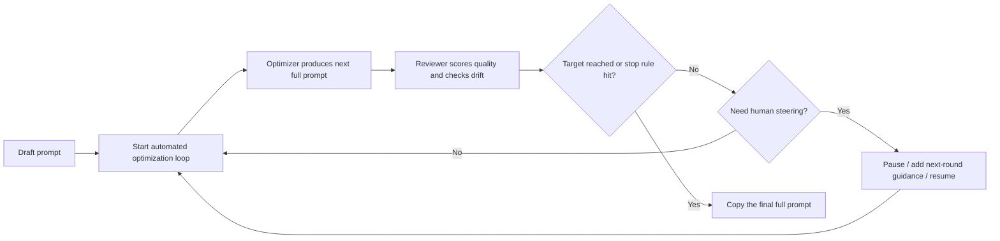

<p align="center">
  
</p>

# Prompt Optimizer Studio

[Chinese Home](README.md) | **English**

<p align="center">
  <a href="https://img.shields.io/github/v/release/XBigRoad/prompt-optimizer-studio?display_name=tag&style=flat-square"></a>
  <a href="https://img.shields.io/badge/edition-self--hosted-2d6a4f?style=flat-square"></a>
  <a href="https://img.shields.io/badge/providers-openai--compatible%20%2B%20more-f4a261?style=flat-square"></a>
  <a href="LICENSE"></a>
</p>

Automated, pipeline-style prompt optimization for people who still want control. ✨ It turns one-off prompt rewriting into a pauseable, steerable, multi-round workflow.
Start from a draft prompt, let the system iterate round by round, and step in whenever the run drifts so you end with a copy-ready full prompt instead of a patch log.

> This repository currently ships the `Self-Hosted / Server Edition`.

<p align="center">
  <a href="#what-you-can-use-it-for"><strong>✨ What It Does</strong></a> ·
  <a href="#how-it-works"><strong>🔄 Workflow</strong></a> ·
  <a href="#start-here"><strong>🚀 Start Here</strong></a> ·
  <a href="#screenshots"><strong>🖼️ Screenshots</strong></a> ·
  <a href="docs/deployment/docker-self-hosted_EN.md"><strong>🐳 Docker Self-Hosted</strong></a> ·
  <a href="https://github.com/XBigRoad/prompt-optimizer-studio/releases"><strong>Releases</strong></a>
</p>

## What You Can Use It For

✨ If what you really want is a prompt you can copy and use, this is the section that matters.

Most prompt optimizers stop at showing diffs, patch fragments, or internal reasoning.

`Prompt Optimizer Studio` is built around a different promise:

| What you need | How Prompt Optimizer Studio helps |
| --- | --- |
| Stop reading patch fragments | It keeps the `latest full prompt` visible and copyable instead of only showing diffs |
| Want automatic multi-round improvement | The optimizer and reviewer keep iterating until they pass or hit a stop rule |
| Need steering when the run drifts | You can pause, add next-round guidance, continue one round, or resume auto, with `goalAnchor` + drift checks helping keep direction |

## How It Works

🔄 From the first draft to the final full prompt, the main path is just this:



## Start Here

🚀 If you want to get started right now, these are the only links you need first:

| What you want to do now | Entry |
| --- | --- |
| Run it locally | [Quick Start](#quick-start) |
| Self-host with Docker | [Docker Self-Hosted Guide](docs/deployment/docker-self-hosted_EN.md) |
| Check release packages and updates | [Releases](https://github.com/XBigRoad/prompt-optimizer-studio/releases) |
| Read common questions | [FAQ](#faq) |

More: [Configuration](#configuration) · [Screenshots](#screenshots)

## What Makes It Feel Different

- **Full prompt first**
  - The main deliverable is the prompt you can actually ship, not a diff viewer.
- **Operator in the loop**
  - Human intervention is a first-class control path, not an afterthought.
- **Multi-round automation with visible stop logic**
  - Runs keep going until they pass the target or hit the configured round limits.
- **Intent protection**
  - `goalAnchor`, drift labels, and reviewer isolation help reduce silent prompt drift.

## Project Docs

- [Chinese Home](README.md)
- [Contributing](CONTRIBUTING_EN.md)
- [Security Policy](SECURITY_EN.md)
- [Code of Conduct](CODE_OF_CONDUCT_EN.md)
- [Open Source Launch Copy](docs/open-source-launch_EN.md)
- [License](LICENSE)

## Screenshots

The screenshots below are captured from the current public candidate running as a local self-hosted instance.

| Control Room | Result Desk | Config Desk |
| --- | --- | --- |
|  |  |  |

## Quick Start

### Requirements

- `Node 22.22.x`
- `npm`

### Local Development

```bash
npm install
npm run dev
```

Open:

```text
http://localhost:3000
```

### Full Verification

```bash
npm run check
```

### Docker Self-Hosted

```bash
cp .env.example .env
docker compose up -d --build
```

Open:

```text
http://localhost:3000
```

Optional health check:

```bash
curl http://localhost:3000/api/health
```

For full deployment instructions, see the [Docker self-hosted guide](docs/deployment/docker-self-hosted_EN.md).

## Configuration

The app is configured from the **Config Desk**.

The Config Desk now exposes:

- `Base URL`
- `API Key`
- quick provider preset
- API protocol override
- global scoring override
- default task model alias
- runtime defaults: `workerConcurrency`, `scoreThreshold`, `maxRounds`

At the job level, the public build also supports:

- task-level scoring override during submission
- current scoring preview inside the Result Desk
- editing task-level scoring override from the job detail page

Supported today:

- **OpenAI-compatible**: `GET /models` + `POST /chat/completions`
- **Anthropic official API**: `GET /v1/models` + `POST /v1/messages`
- **Gemini official API**: `GET /v1beta/models` + `POST /v1beta/models/{model}:generateContent`
- **Mistral official API**: `GET /models` + `POST /chat/completions`
- **Cohere official API**: `GET /v2/models` + `POST /v2/chat`

Common provider presets include:

- `OpenAI`
- `Anthropic (Claude)`
- `Google Gemini`
- `Mistral`
- `Cohere`
- `DeepSeek`
- `Moonshot (Kimi)`
- `Qwen`
- `GLM`
- `OpenRouter`

Common `Base URL` examples:

- `https://api.openai.com/v1`
- `https://api.anthropic.com`
- `https://generativelanguage.googleapis.com`

Official APIs work directly from their provider root. No custom proxy path is required.

## Deployment Model

This repository currently ships the **Self-Hosted / Server Edition**.

- Local `npm` runs store data on the machine running the app.
- Docker deployments store data in the mounted server-side volume, not in each user's browser.
- Server-originated requests remain the broadest compatibility path for OpenAI-compatible endpoints.
- A separate `Web Local Edition` is planned later, but it is not shipped here today.

Default SQLite path:

```text
data/prompt-optimizer.db
```

You can override it with:

```bash
PROMPT_OPTIMIZER_DB_PATH=/your/custom/path.db
```

## FAQ

- **Is this a hosted SaaS?**
  - No. This repository currently ships the self-hosted server edition.
- **What is the main output?**
  - A copy-ready full prompt produced by an automated multi-round optimization pipeline.
- **Can I intervene during optimization?**
  - Yes. You can pause a task, add next-round steering, continue one round, or resume automatic execution.
- **Which APIs does it support?**
  - The current public build supports OpenAI-compatible, Anthropic, Gemini, Mistral, and Cohere, with presets and protocol mapping for DeepSeek, Kimi, Qwen, GLM, and OpenRouter.
- **Can I customize the scoring rubric?**
  - Yes. The Config Desk supports a global scoring override, and each job can also carry its own task-level scoring override in Markdown.
- **Can I switch the interface to English?**
  - Yes. The current public build already includes an in-app `中文 / EN` toggle.
- **Where is data stored?**
  - In the local SQLite database on the machine or mounted volume running the app.
- **Why AGPL-3.0?**
  - Because modified hosted versions should remain source-available to the users who depend on them.

## Contributing And License

- Contribution guide: [`CONTRIBUTING_EN.md`](CONTRIBUTING_EN.md)
- Security policy: [`SECURITY_EN.md`](SECURITY_EN.md)
- Code of conduct: [`CODE_OF_CONDUCT_EN.md`](CODE_OF_CONDUCT_EN.md)

This project is licensed under `AGPL-3.0-only`.

In plain language:

- you can use, study, modify, and self-host it
- if you distribute a modified version, or run a modified version for other users over a network, you must provide the corresponding source code under AGPL as well
- see [`LICENSE`](LICENSE) for the full text
